# Garage System Frontend

Web client for **Garage System**, an auto repair shop management platform. It covers the daily workflow of a workshop: customers and vehicles, the service and parts catalog, and service orders from opening to completion, with access control by user role.

The application is a single-page React app built with Vite. It talks to the [Garage System backend](https://github.com/Peaguinha/garage-system-backend) over REST and GraphQL.

This repository is the second phase of an academic project developed by a six-person team. The backend was delivered in the first phase.

## Table of contents

- [Screenshots](#screenshots)
- [Features](#features)
- [Roles and permissions](#roles-and-permissions)
- [Technology stack](#technology-stack)
- [Architecture](#architecture)
- [Getting started](#getting-started)
- [Environment variables](#environment-variables)
- [Available scripts](#available-scripts)
- [Backend integration](#backend-integration)
- [Project structure](#project-structure)
- [Development workflow](#development-workflow)
- [Known limitations](#known-limitations)
- [Team](#team)
- [License](#license)

## Screenshots

All screenshots were captured at 1440 x 900 (and 390 x 844 for mobile) against a demonstration dataset, not production data. The interface language is Brazilian Portuguese.

### Authentication

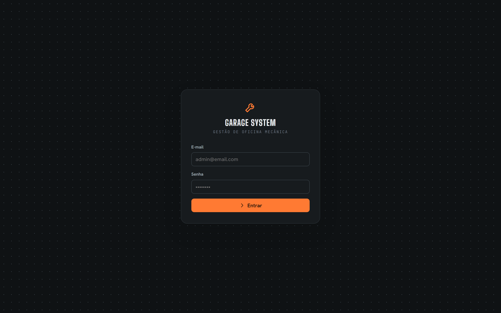

Sign-in with e-mail and password. A successful login stores a JWT session and redirects to the application; routes are protected and unauthenticated visitors are sent back to the login screen.

### Service orders

The service order is the core module. It offers a kanban board, where a card can be dragged to the next column to advance its status, and a list view.

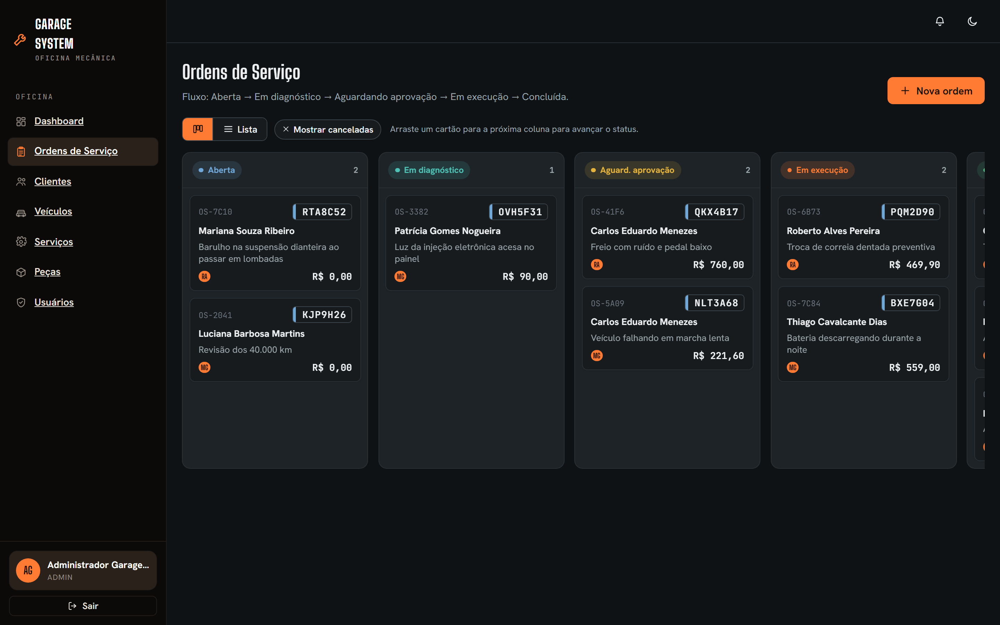

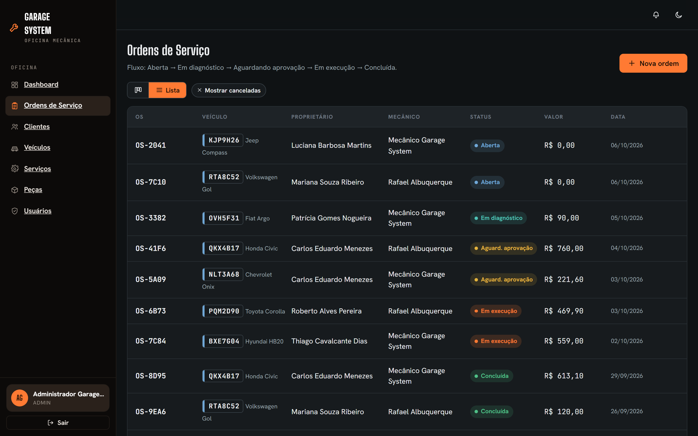

The detail page shows the status stepper, the customer and vehicle, the responsible mechanic, the diagnosis, the services and parts applied to the order, and a financial summary calculated from them.

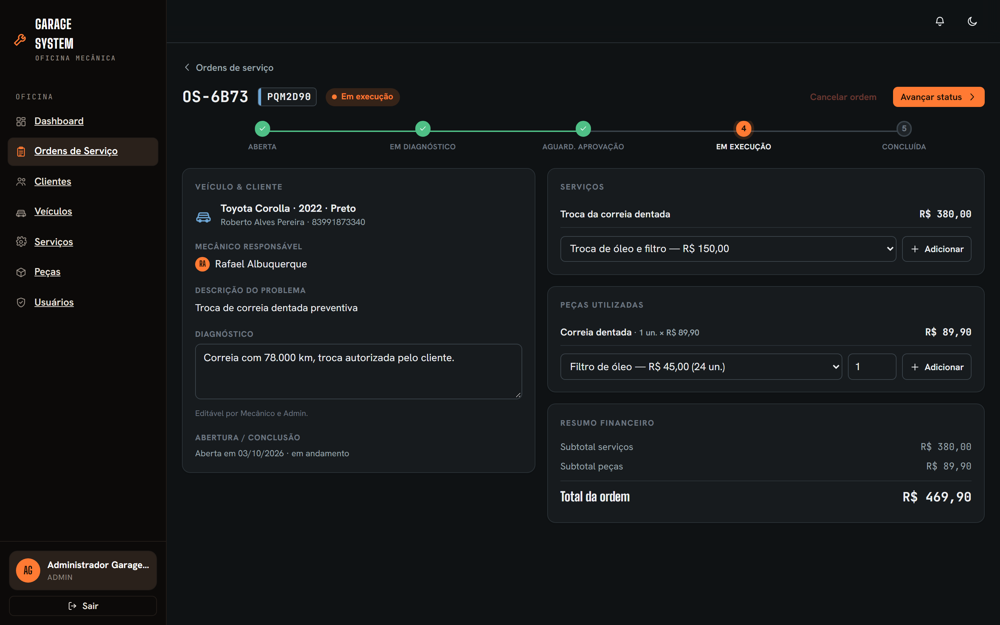

The interface supports a light and a dark theme. The theme follows the operating system preference and the choice is persisted.

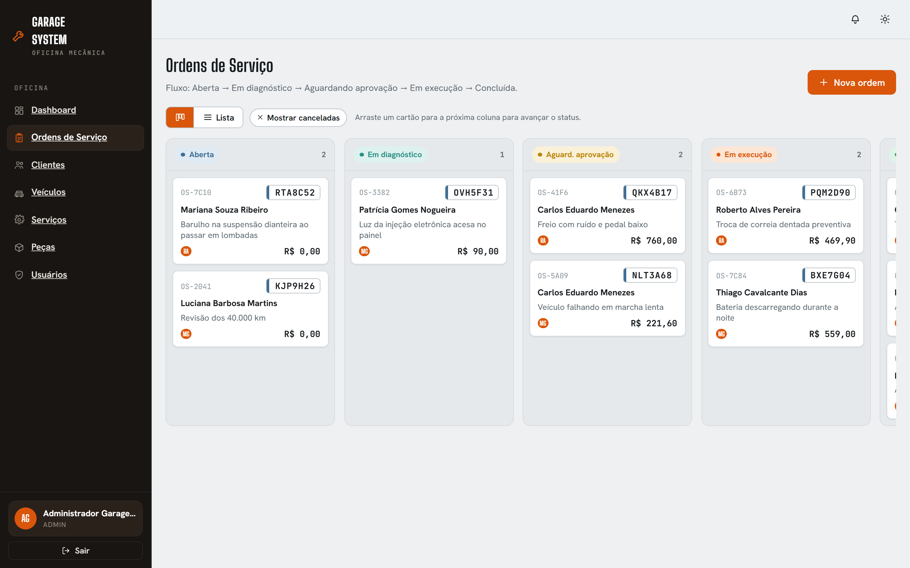

### Customers and vehicles

Customers expand inline to show contact data and their linked vehicles. Both lists support search, creation, editing and deletion with confirmation.

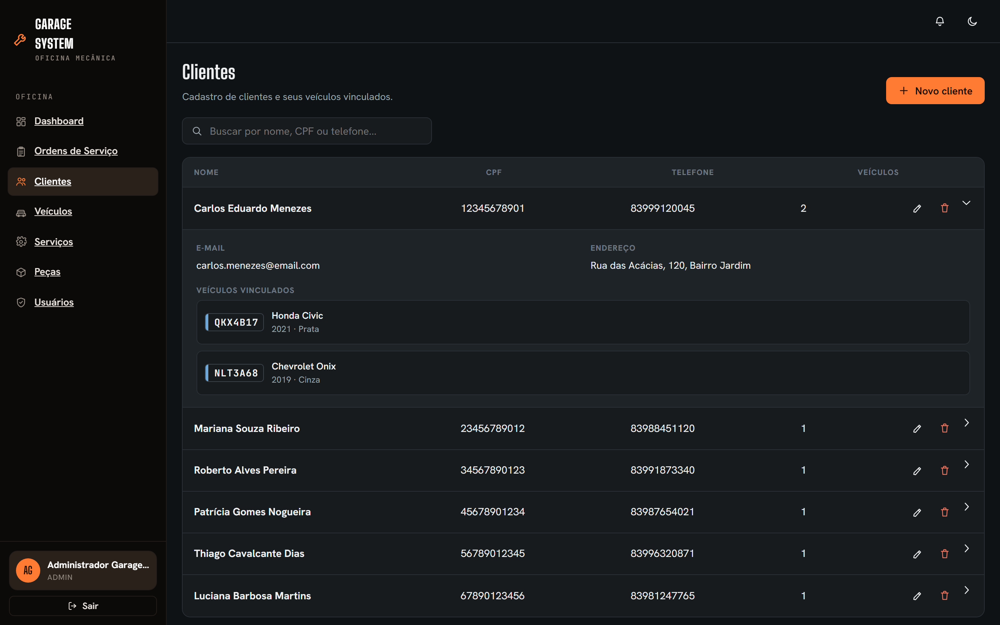

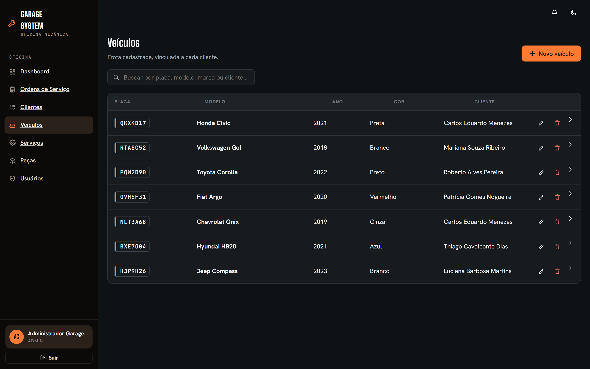

### Services and parts catalog

Parts below five units in stock are flagged as low stock. Creating, editing and deleting catalog items is restricted to administrators.

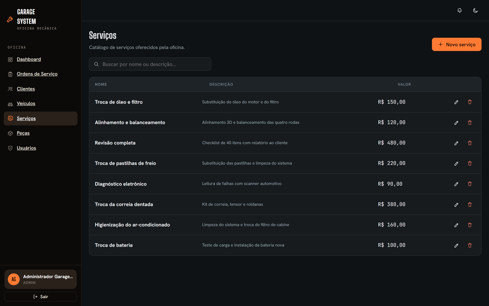

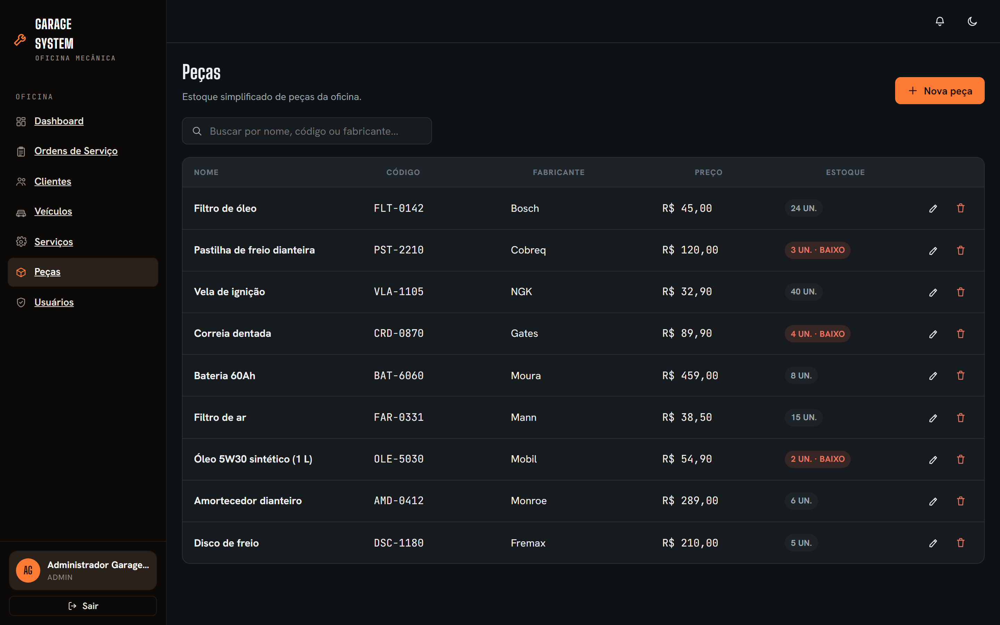

### Users and access control

User management is available to administrators only. Other roles do not see the module in the navigation and are denied access if they open its address directly.

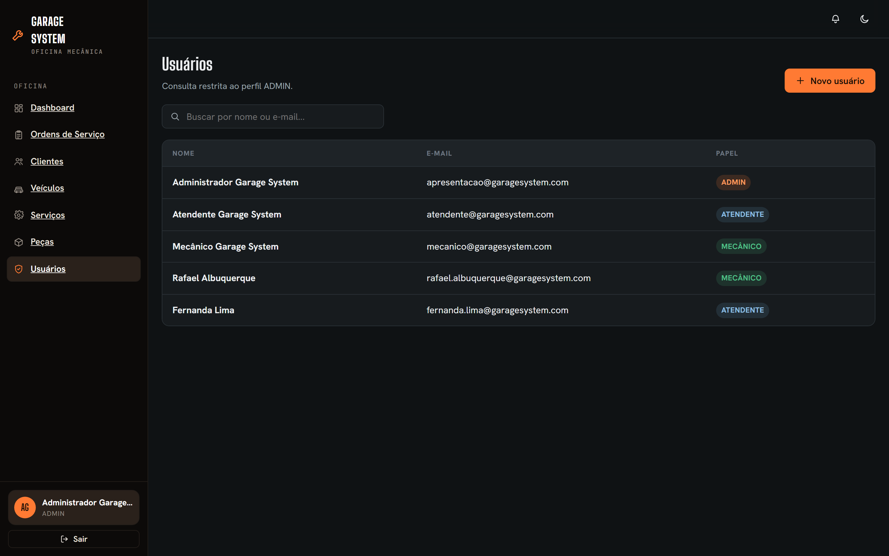

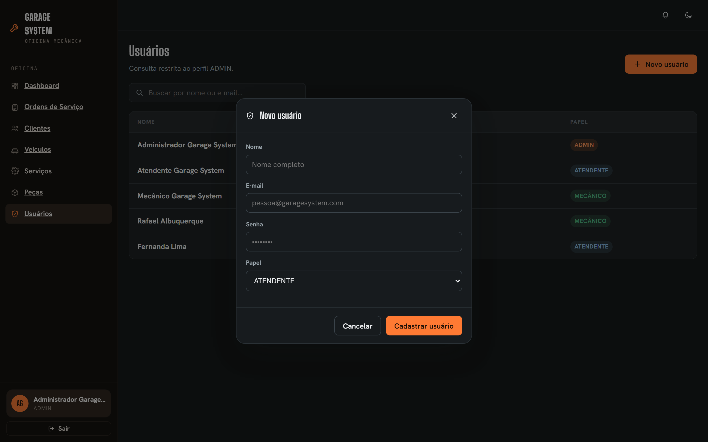

The navigation adapts to the signed-in role. The example below shows the mechanic profile, which has no access to the users module.

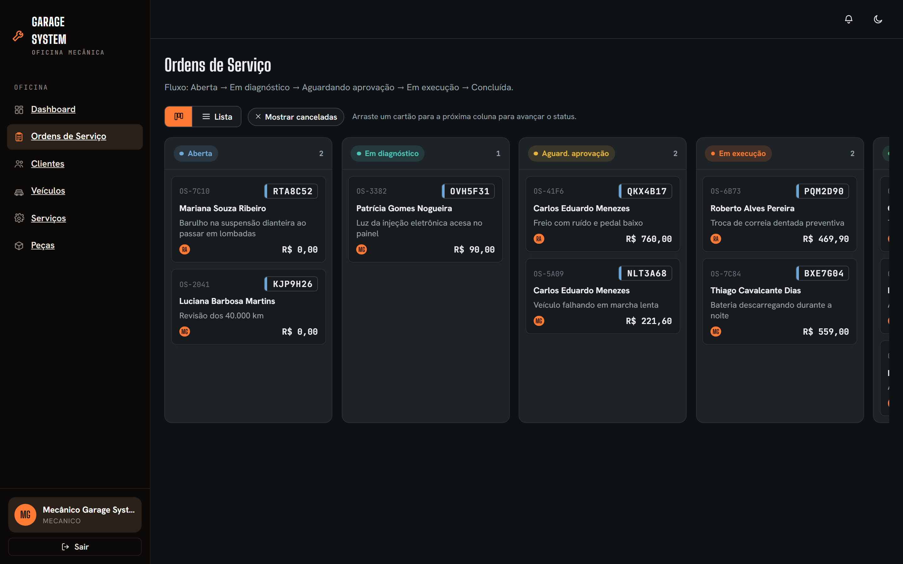

### Dashboard

The dashboard module is under development and its screenshot will be added here when it is merged.

<!-- When the dashboard is merged, save the capture as docs/screenshots/dashboard.png and replace the image below. -->
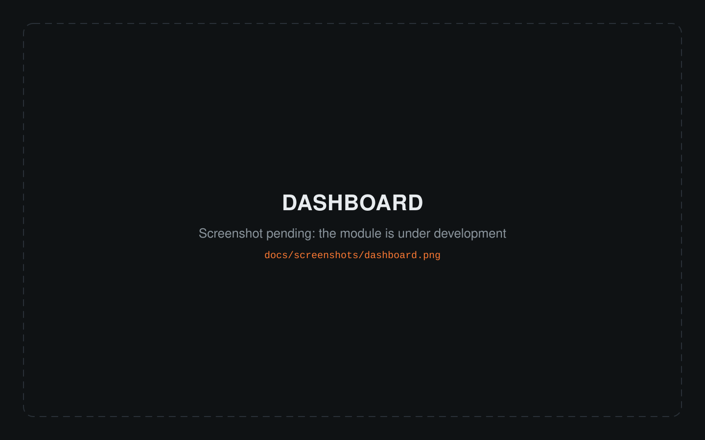

### Responsive layout

On small screens the sidebar becomes a drawer and the four most used destinations move to a bottom navigation bar.

<table>
  <tr>
    <td width="33%">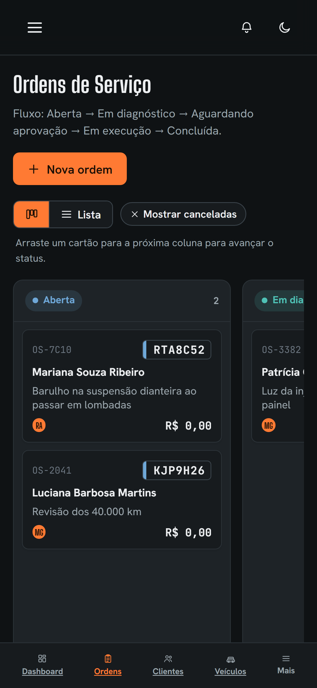</td>
    <td width="33%">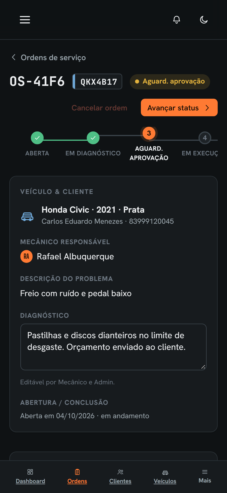</td>
    <td width="33%">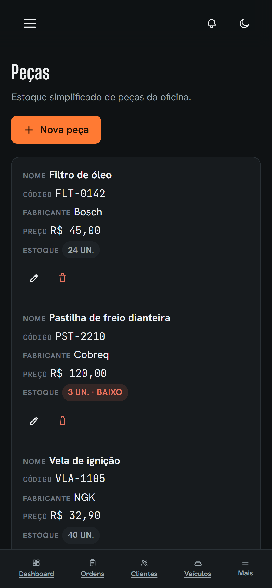</td>
  </tr>
</table>

## Features

| Module | Description | Data source |
| --- | --- | --- |
| Authentication | E-mail and password login, persisted JWT session, protected routes and role-based navigation | REST |
| Dashboard | Operational overview. Under development | REST |
| Service orders | Kanban and list views, order creation, status flow with drag and drop, diagnosis, services and parts, financial summary | GraphQL for reads, REST for writes |
| Customers | Registration with search, inline details and linked vehicles | REST |
| Vehicles | Registration linked to a customer, with search | REST |
| Services | Service catalog with prices | REST |
| Parts | Inventory with code, manufacturer, price, stock and low-stock highlight | REST |
| Users | User listing and creation, administrators only | GraphQL for reads, REST for writes |

Service orders follow a controlled status flow: Open, In diagnosis, Awaiting approval, In execution and Completed. An order can be cancelled while it is still open or in diagnosis. Stock is validated before a part is added to an order.

## Roles and permissions

The application has three roles, identified in the backend as `ADMIN`, `ATENDENTE` (attendant) and `MECANICO` (mechanic). The interface mirrors the permissions of the backend. Actions a role cannot perform are not displayed, or are disabled when the restriction depends on the order status.

| Capability | Admin | Attendant | Mechanic |
| --- | :---: | :---: | :---: |
| View service orders | Yes | Yes | Yes |
| Create a service order | Yes | Yes | No |
| Advance the order status | Yes | No | Yes |
| Cancel an order (while open or in diagnosis) | Yes | Yes | No |
| Edit the diagnosis (until the order is finished) | Yes | No | Yes |
| View and manage customers and vehicles | Yes | Yes | Yes |
| View services and parts | Yes | Yes | Yes |
| Create, edit and delete services and parts | Yes | No | No |
| View and create users | Yes | No | No |

The backend enforces the restrictions on services, parts and user creation. For service orders the restriction is currently applied in the interface only (see [Known limitations](#known-limitations)).

## Technology stack

| Area | Technology |
| --- | --- |
| Framework | React 19 |
| Build tool and dev server | Vite 8 |
| Routing | React Router 7 |
| State | React Context and hooks, with local state per feature |
| Styling | Plain CSS with design tokens, light and dark themes |
| Data access | Fetch-based REST client and a small GraphQL client |
| Linting and formatting | oxlint and Prettier |

## Architecture

The code is organized in three layers:

- `app` holds the application shell: routes, the responsive layout (sidebar on desktop, drawer and bottom navigation on mobile) and the authentication context.
- `features` holds one folder per module. Each feature owns its pages, forms and data access module.
- `shared` holds what is used by more than one feature: API clients, UI components, hooks, styles and utilities. A component used by more than one feature lives here and is never duplicated inside a feature.

### Data access

- **REST.** All requests go through a single client (`src/shared/api/client.js`) that sets the base URL and the `Authorization` header, and unwraps the `{ success, data, message }` envelope returned by the backend. Features must use this client instead of calling `fetch` directly.
- **GraphQL.** Used where one query is clearly better than several REST calls: reading service orders returns the vehicle, the customer and the mechanic in a single request, and the users list is only exposed through GraphQL. Writes always go through REST, where the business rules are concentrated.

### Authentication

The session (token and user) is stored in `localStorage`. The token is handed to the REST and GraphQL clients when the session is created, before any page fetches data, so a page reload keeps working. Route guards redirect anonymous visitors to the login screen, and a role guard hides or denies modules by role.

### Styling

Colors, typography and spacing are defined as design tokens in `src/shared/styles/tokens.css` and consumed by `base.css`. The light and dark themes share the same tokens. The visual identity comes from the project prototype.

## Getting started

### Prerequisites

- Node.js `^20.19.0` or `>=22.12.0` (required by Vite 8) and npm
- The [Garage System backend](https://github.com/Peaguinha/garage-system-backend) running, with its MongoDB database available

### Installation

Clone the repository:

```bash
git clone https://github.com/Peaguinha/garage-system-frontend.git
```

Install the dependencies:

```bash
cd garage-system-frontend && npm install
```

Create the environment file (on Windows use `copy` instead of `cp`):

```bash
cp .env.example .env
```

Start the development server:

```bash
npm run dev
```

The application is served at `http://localhost:5173`. If that port is taken, Vite picks the next free one and prints it in the terminal.

Sign in with a user that exists in the backend database. Users can be created by an administrator from the Users screen. On an empty database, the first user can be created through the backend API.

## Environment variables

Variables are read at build time and must be prefixed with `VITE_`. The defaults match the backend running locally.

| Variable | Default | Description |
| --- | --- | --- |
| `VITE_API_URL` | `http://localhost:3000/api` | Base URL of the backend REST API |
| `VITE_GRAPHQL_URL` | `http://localhost:3000/graphql` | URL of the backend GraphQL endpoint |

## Available scripts

| Command | Description |
| --- | --- |
| `npm run dev` | Starts the development server with hot reload |
| `npm run build` | Creates the production build in `dist/` |
| `npm run preview` | Serves the production build locally |
| `npm run lint` | Runs oxlint on the source code |

## Backend integration

The backend is a separate repository: [garage-system-backend](https://github.com/Peaguinha/garage-system-backend). It must allow the origin of the frontend (CORS), which the `develop` branch of the backend already does.

| Area | Operations used |
| --- | --- |
| Authentication | `POST /api/auth/login` |
| Users | `POST /api/auth/usuarios` (administrators), GraphQL `usuarios` |
| Customers | `GET`, `POST /api/clientes` and `PUT`, `DELETE /api/clientes/:id` |
| Vehicles | `GET`, `POST /api/veiculos` and `PUT`, `DELETE /api/veiculos/:id` |
| Services | `GET`, `POST /api/servicos` and `PUT`, `DELETE /api/servicos/:id` |
| Parts | `GET`, `POST /api/pecas` and `PUT`, `DELETE /api/pecas/:id` |
| Service orders (write) | `POST /api/ordens-servico`, `PUT /api/ordens-servico/:id` (diagnosis), `PATCH` on `/status`, `/servicos` and `/pecas` |
| Service orders (read) | GraphQL `ordensServico`, `ordemServico`, `servicos`, `pecas` and `veiculos` |

## Project structure

```text
src/
  app/                      Routes, layout, navigation and auth context
  features/
    auth/                   Login
    dashboard/              Dashboard (under development)
    clientes/               Customers
    veiculos/               Vehicles
    ordens-servico/         Service orders: kanban, list, detail
    servicos/               Services catalog
    pecas/                  Parts inventory
    usuarios/               Users
  shared/
    api/                    REST and GraphQL clients
    components/             Modal, confirmation dialog, toast, icons, guards
    hooks/                  Authentication, theme and toast hooks
    styles/                 Design tokens and base styles
    utils/                  Formatting helpers
docs/
  screenshots/              Images used by this README
```

## Development workflow

The repository follows the same branching model as the backend:

```text
main      stable version
develop   integration of finished features
feature/* and fix/*   short-lived branches created from develop
```

1. Create a branch from `develop` named `feature/<name>` or `fix/<name>`.
2. Commit using [Conventional Commits](https://www.conventionalcommits.org/), written in English (for example `feat(parts): add low stock badge`).
3. Open a pull request into `develop`. At least one teammate reviews it before the merge, which is done with a merge commit.
4. When `develop` is stable it is promoted to `main` through a pull request.

A module is considered done when it follows the visual reference of the prototype on desktop and mobile, uses real API data with loading, error and empty states handled, respects the role permissions, does not duplicate components that already exist in `shared/`, and has been reviewed.

## Known limitations

- The dashboard module is not merged yet.
- Services and parts can be added to a service order but not removed, because the backend has no route for it.
- The backend does not apply role restrictions to the service order routes, so those restrictions currently exist only in the interface.
- Users can be listed and created, but not edited or deleted, because the backend does not expose those operations.
- The interface is available in Brazilian Portuguese only.
- There is no automated test suite in this repository yet.

## Team

- Pedro Henrique de Almeida Peixoto
- Washingtton Lucena Bandeira Filho
- Igor Araújo
- Israel Neto
- Kaik
- Nathan Esley

The frontend modules were distributed among the team members. Authorship of each module is recorded in the pull request history.

## License

This repository was developed for academic purposes. No open-source license has been applied.
